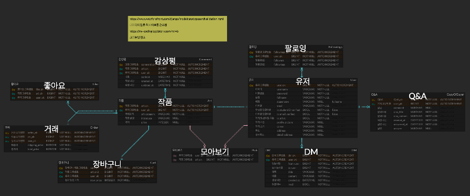

[NES](http://nes-env.eba-9ycvw3yi.ap-northeast-2.elasticbeanstalk.com/)

# NES; Never Ending Story

NES팀은 젊은 예술가들이 직면할 수 밖에 없는 작품의 전시와 그에 따른 비용에 관한 문제를 어떻게 해소시켜 줄 수 있을지 고민하였습니다.

**'끝나지 않는 이야기’** 라는 뜻을 담고 있는 저희 팀 이름은 위와 같은 고민으로부터 출발했습니다.

NES 팀은 젊은 예술가들의 어려움에 공감하며 그들의 꿈을 이루는 것을 돕고자 **졸업 작품 중개 서비스**를 기획하였습니다.
 
 

* 개발기간: 2022.11.28 ~ 2022.12.15

## 팀원 소개

#### articles, orders 담당
* articles
    * 작품 CRUD
    * 페이지네이션
    * 댓글
    * 좋아요 비동기
    * 검색
 

* orders
    * 가격 제시 화면 구현
    * 장바구니 추가 및 삭제
    * 주문 및 결제 (이니시스 API)

 
 

# Modeling
## ERD 모델

## 와이어 프레임

## 기능 소개
 

### Intro

## Review
